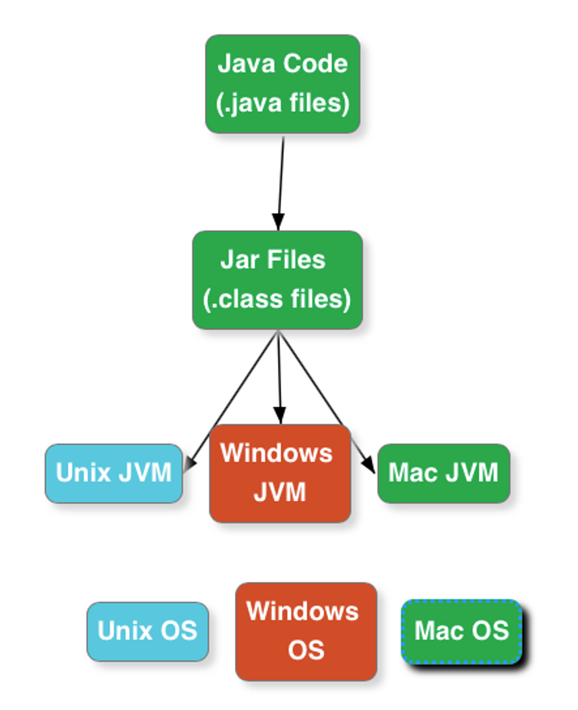

	
## Why is Java so Popular?

Java is one of the most popular languages because Java has several contributions to its widespread adoption and continued relevance in the software development industry. So Java has some key factors which make it  a popular programming language.

- **Simple:-** Java is easy to learn and its syntax is quite simple, clean, and easy to understand. Apart from this automatic memory management also play a role in the same
- **Object-Oriented**:- Java is ***object-oriented***, it supports all the OOPS characteristics. This makes Java applications easy to develop and maintain, compared to structured programming languages.
- **Platform Independent:-** Java source code is compiled and converted into bytecode. this bytecode can run on multiple platforms i.e. Write Once and Run Anywhere(WORA), we can compile the java code in one Operating System and execute it on another Operating System. The WORA makes java an Architecture Neutral language. Java also standardized all data types that also contributed to making java a platform-independent language.

  

	
## What is Platform Independence?

Platform independence, also known as "write once, run anywhere," refers to the ability of a programming language or framework to run on different platforms without requiring extensive modifications. In the context of Java, platform independence is one of its key features.

Java is one of the most popular platform-independent languages. Once we compile a Java program and build a jar, we can run the jar (compiled Java program) in any Operating System - where a JVM is installed. Java achieves Platform Independence in a beautiful way. On compiling a Java file the output is a class file- which contains an internal Java representation called bytecode. 

JVM converts bytecode to executable instructions. The executable instructions are different in different operating systems. So, there are different JVM for different operating systems. A JVM for Windows is different from a JVM for Mac. However, both the JVM's understand the bytecode and convert it to the executable code for the respective operating system.

  

	
## What is ByteCode?

Bytecode is a low-level representation of code that is executed by a virtual machine (VM) rather than directly by the hardware. It serves as an intermediate step between source code and machine code, enabling platform independence and facilitating efficient execution.

If i talk about Java, when you write a Java program, it is first compiled into bytecode. And the Java compiler (javac) translates the human-readable Java source code into a compact and platform-neutral binary format which is called by bytecode. This bytecode is stored in .class files.

Bytecode is designed to be easily interpreted and executed by the Java Virtual Machine (JVM), which is specific to each platform or operating system. Instead of directly executing machine-specific instructions, the JVM reads the bytecode instructions one by one and dynamically translates them into machine code that can be executed by the underlying hardware.

  

	
## Compare JDK vs JVM VS JRE.

JDK (Java Development Kit), JVM (Java Virtual Machine), and JRE (Java Runtime Environment) are key components of the Java platform. Each serves a specific purpose in the Java development and execution process. Here's a comparison of these three components:
	

	
### JDK (Java Development Kit):
The JDK is a software development kit that includes the necessary tools and libraries for Java development.
It contains the Java compiler (javac) that translates Java source code into bytecode, which can be executed by the JVM.
The JDK also includes other tools, such as the Java debugger (jdb), documentation generator (javadoc), and various utilities for packaging and deploying Java applications.
Developers use the JDK to write, compile, and package Java applications. It provides all the necessary components to develop and build Java software.

### JVM (Java Virtual Machine):
The JVM is an integral part of the Java platform. It is an abstract machine that executes Java bytecode.
The JVM interprets the bytecode instructions and translates them into machine code that can be understood and executed by the underlying hardware.
It provides several services essential for Java execution, including memory management, garbage collection, security, and exception handling.
The JVM is platform-dependent, meaning that there are different implementations of the JVM for different operating systems and hardware architectures.
It ensures platform independence by providing a standardized runtime environment, allowing Java programs to run consistently across different platforms without requiring recompilation.

### JRE (Java Runtime Environment):
The JRE is a subset of the JDK. It includes the necessary components to run Java applications but does not contain the development tools like the compiler and debugger.
The JRE consists of the JVM, Java class libraries, and other runtime dependencies required for executing Java applications.
It provides the runtime environment for running Java applications on end-user machines or servers.
Users who only need to run Java applications, rather than developing them, can install the JRE. It allows them to execute Java programs without the need for the full JDK.

  

	
## What is the role of class loader in java ?

Java ClassLoader is an abstract class. It belongs to a java.lang package. It loads classes from different resources. Java ClassLoader is used to load the classes at run time. In other words, JVM performs the linking process at runtime. Classes are loaded into the JVM according to need. If a loaded class depends on another class, that class is loaded as well. When we request to load a class, it delegates the class to its parent. In this way, uniqueness is maintained in the runtime environment. It is essential to execute a Java program.

